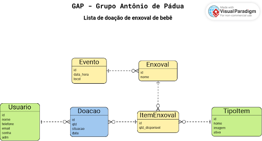
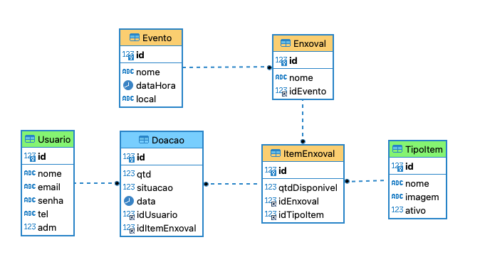

# Chadebebe - Sistema de Doação de Enxoval de Bebês

Sistema de Doação de Enxoval de Bebês do GAP - Grupo Antônio de Pádua.

## Sobre o Projeto

Este sistema permite o gerenciamento de doações de itens para enxovais de bebês, facilitando:

- Cadastro de eventos
- Cadastro de tipos de itens
- Gerenciamento de enxovais
- Registro e acompanhamento de doações

## Tecnologias Utilizadas

- React
- Typescript
- RestAPI 
- Python (back-end)
- Flask (back-end)
- SQLite (persistência no back-end)

## Funcionalidades

### Administrador:
- Cadastrar tipos de itens
- Cadastrar eventos mensais
- Gerenciar enxovais

### Usuário Comum:
- Escolher itens para doação
- Visualizar suas doações
- Ver lista de doadores

 
##Definição:

### DER:

### DED:

###SQL:

[SQL - Script DDL do DBGAP](dbgap.sql)

###Especificão:

As 2 imagens e o script SQL acima se referem, respectivamente, ao Diagrama Entidade-Relacionamento, ao Diagrama de Estrutura de Dados e ao script DDL de um sistema web para doação para enxoval de bebê, com as características abaixo:

O sistema deve ser dotado de um sistema de login, que usurá as colunas email e senha da tabela Usuario para persistir, respectivamente, o userName e a hashSenha.

O sistema terá dois tipos de usuário: usuário comum e usuário administrador.

O usuário administrador logado pode cadastrar os tipos de itens de enxoval.

O usuário administrador logado pode cadastrar os eventos mensais.

O usuário administrador logado pode cadastrar até três enxovais para um evento com seus respectivos itens, definindo os seus tipos de item e suas quantidades disponíveis.

Um usuário comum logado pode escolher na lista de itens da cada enxoval de um evento suas doações para o evento, aumentando ou diminuindo a quantidade de cada item que pretende doar, que variará da quantidade inicial 0 (nenhum) até a quantidade ainda disponível do item de enxoval.

Um usuário comum logado pode ver a lista de suas doações para um evento, mostrando a quantidade, o nome do tipo de item e, entre parênteses, o nome do enxoval.

Um usuário comum logado pode ver a lista de itens de cada enxoval de um evento, que apresentará uma coluna com o nome dos doadores do item (se houver) acrescido da quantidade total doada e da quantidade ainda disponível entre parênteses no formato: (doados: <d> restam: <r>). 

As páginas da interface devem ter a usabilidade simples e intuitiva e a identidade visual que lembram os bebês.

Aqui está um exemplo para a interface: [interface](index.html)

###Persona:
Atue como um engenheiro de software experiente em React/Typescript e Python/Flask, amante do paradigma orientado a objetos e atento aos princípios SOLID, Clean Code e boas práticas de programação.

###Solicitação:

Analise com cuidado as informações acima, reflita sobre  o melhor projeto para a solução e contrua uma aplicação Web responsiva para rodar tanto em computadores e quanto celulares, usando a tecnologia React/Typescript.

Desenvolva, passo a passo, a aplicação seguindo o seguinte processo:
1) Detalhamento da especificação: analise a proposta, organize e detalhe todas as funcionalidade da aplicação.
2) Planejamento da arquitetura e da implementação do front-end: Analise a especificação e planeje a implementação do front-end.
Obs: a fim de testar o front-end sem implementar ainda o back-end, separere as responsabilidades de definir a conexão a fim de que se possa utilizar o SQLite localmente para testar as funcionalidades da plicacão antes da criação do back-end.
3) Implemente, passo a passo, o front-end da plicação usando o paradigma orientado a objetos e atento aos princípios SOLID, Clean Code e boas práticas de programação.

